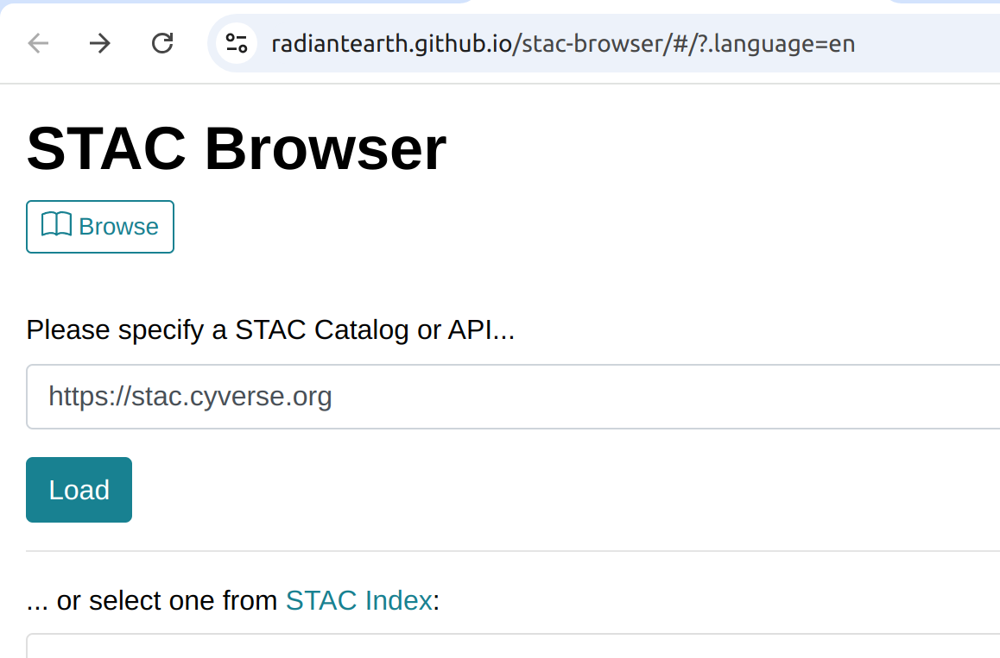

# SpatioTemporal Asset Catalog

**SpatioTemporal Asset Catalogs (STAC)** is a json and geojson based metadata standard to describe geospatial data. STAC is an open-source project who's goal is to make geospatial data more easily worked with, indexed, and discovered. STAC is a great option if you are a data provider that would like to make your data more open and accessible to the world. General information can be found at [STAC Index.org](https://stacindex.org/) and the [STAC Spec](https://stacspec.org/en). 

The [Open Forest Observatory(OFO)](https://openforestobservatory.org/) is indexing all datasets using the STAC json metadata standard and also serving out the data through a STAC compliant API. 

 

## Access OFO Data with Browser

OFO datasets can be browsed and searched using the [Radiant Earth STAC Browser](https://radiantearth.github.io/stac-browser/#/?.language=en). 

At the STAC search bar, type: `https://stac.cyverse.org` and then click the `load` button. 

 

Alternatively, you can directly [Browse OFO STAC Catalog](https://radiantearth.github.io/stac-browser/#/external/stac.cyverse.org/)

The STAC browser is an open-source project with all code available in a [github repository](https://github.com/radiantearth/stac-browser). OFO _could_ serve it's own version of the STAC browser but is currently not. 

 
 

## Access OFO Data with Python

You can programmatically access OFO data through the STAC API. Pre-written python code available to help you get started. 

Learn how to use python to access OFO data using Google Colab. 

Download and run a [juypter notebook locally](./blob/main/scripts/STAC_API.ipynb)

## How to Create STAC Json Metadata

STAC compliant json & geojson files are creating by running [this python script](./scripts/STAC_creation_OFO.ipynb) across OFO data (in Cyverse Data Store at `/data-store/iplant/home/shared/ofo/public/missions`) and across the OFO metadata gpkg file (in Cyverse Data Store at `/data-store/iplant/home/shared/ofo/public/metadata/all-mission-polygons-w-metadata.gpkg`).

The python script is currently intended to run in the Cyverse Discovery Environment from the Jupyterlab:Geospatial container app. The script could be amended to run outside of the Cyverse DE if necessary. 

The python script will output two files. These are examples and not the production files: 

  * [collection.json](./stac_json/collection.json)
  * [index.geojson](./stac_json/index.geojson) 

 

## Serving the STAC API

The OFO STAC API is being served on a VM hosted by Cyverse at the University of Arizona. Find details of the STAC API deployment at this [repository](https://github.com/cyverse-gis/cyverse-stac). This repository is where the production STAC files (`collection.json` & `index.geojson`) are kept. 

